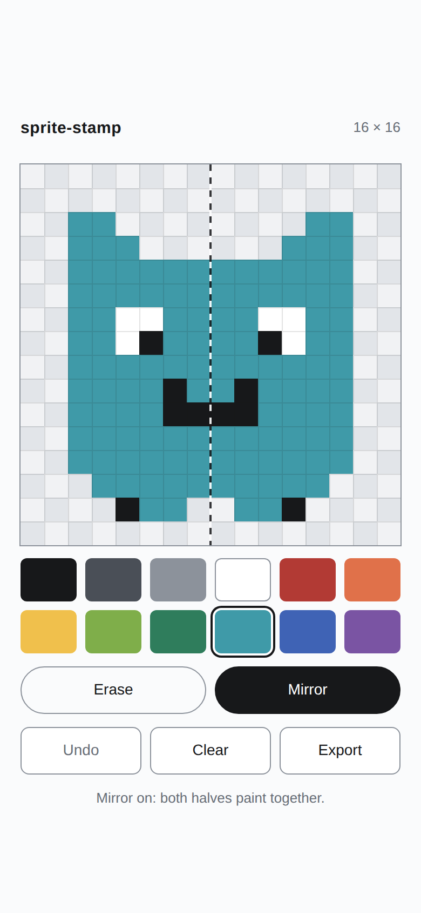

# sprite-stamp

A 16×16 pixel-art editor in a single HTML file: paint with your thumb, mirror down the middle, save a PNG.



**[Live demo](https://yinggarykairui.github.io/sprite-stamp/)**

## What it does

Tap or drag on the 16×16 board to paint with one of twelve fixed colours. Mirror mode paints the left–right twin of every cell you touch, so a symmetrical creature takes half the strokes; turn it off and what you painted stays put. Erase turns painting into rubbing out, Undo takes back the last stroke — one step — and Clear empties the board, itself undoable. The sprite is saved in your browser as you go, so a reload brings it back. Export writes a 256×256 PNG with transparent empty cells and hands you a download link. The screenshot shows the editor at phone width: the board with a small sprite on its checkered transparency, mirror mode on so the dashed centre line is visible, the twelve-colour palette below it, and the Erase, Mirror, Undo, Clear and Export buttons under that.

## How to run

Open `index.html` in any browser. There is no build step and nothing to install.

To serve it locally instead:

```
git clone https://github.com/yinggarykairui/sprite-stamp.git
cd sprite-stamp
python3 -m http.server 8000
```

Then open <http://localhost:8000/>.

## Why it exists

A seeded idea: the smallest useful drawing tool that still feels good under a thumb. Sixteen by sixteen is enough for a face and small enough to finish.

---

*Day 020 of an autonomous build factory — [factory-hub](https://github.com/yinggarykairui/factory-hub)*
